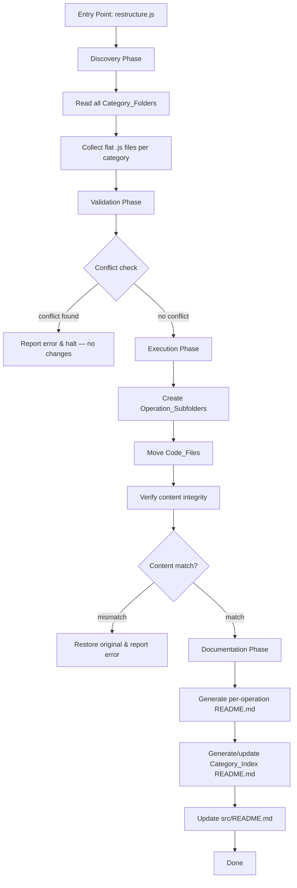

# Design Document

## Feature: Nested Folder Structure

---

## Overview

This feature migrates the `src/` directory of the JavaScript DSA practice project from a flat per-category layout to a two-level hierarchy where every algorithm lives in its own dedicated subfolder. The restructuring is a one-time, idempotent migration that:

1. Moves each `src/<category>/<algorithm>.js` file to `src/<category>/<algorithm>/<algorithm>.js`
2. Creates a `README.md` inside every operation subfolder documenting the algorithm
3. Creates or updates a `README.md` at the root of every category folder listing all operations
4. Updates `src/README.md` to reflect the new hierarchy

The implementation is a Node.js script (`scripts/restructure.js`) that reads the filesystem, computes the required transformations, validates for conflicts, executes the moves, and generates all documentation files. No external registry or manifest is created — the folder structure itself is the source of truth.

---

## Architecture



The script is designed to be **atomic per file**: each file move is verified before proceeding. If any verification fails, the original file is restored and the script halts with a descriptive error message.

---

## Components and Interfaces

### `restructure.js` — Main Script

The single entry point. Orchestrates all phases in sequence.

```
node scripts/restructure.js [--dry-run]
```

- `--dry-run`: Print planned operations without making filesystem changes.

### `discoverAlgorithms(srcDir)`

**Input:** Path to `src/` directory  
**Output:** `Map<categoryName, AlgorithmFile[]>`

Reads each Category_Folder and returns all `.js` files found directly at the category root level (not in subfolders). Ignores files already inside subfolders (idempotency).

```js
// AlgorithmFile shape
{
  category: string,       // e.g. "linked-list"
  baseName: string,       // e.g. "reverse-k-group"
  originalPath: string,   // e.g. "src/linked-list/reverse-k-group.js"
  targetDir: string,      // e.g. "src/linked-list/reverse-k-group"
  targetPath: string,     // e.g. "src/linked-list/reverse-k-group/reverse-k-group.js"
}
```

### `validateNoConflicts(algorithms)`

**Input:** `Map<categoryName, AlgorithmFile[]>`  
**Output:** `{ ok: boolean, conflicts: string[] }`

For each planned `targetDir`, checks whether a directory with that name already exists and is not the expected empty-or-new subfolder. Returns all conflicts found before any filesystem changes are made.

### `moveFile(originalPath, targetPath)`

**Input:** Source and destination paths  
**Output:** `{ ok: boolean, error?: string }`

1. Reads the source file content into memory
2. Creates the destination directory
3. Writes content to destination
4. Reads back the destination content
5. Compares byte-for-byte with the original
6. If mismatch: deletes destination, returns error
7. If match: deletes source, returns ok

### `generateOperationReadme(algorithmFile, lcData)`

**Input:** `AlgorithmFile`, `lcData` map (from `src/README.md` parsing)  
**Output:** Markdown string

Produces a README with these sections:
- Problem title (derived from `baseName`, title-cased)
- LeetCode number and link (from `lcData`, or placeholder if unknown)
- Problem description summary (placeholder — to be filled manually or via future enhancement)
- Approach description (placeholder)
- Time and space complexity (placeholder)

### `generateCategoryIndex(categoryName, algorithms)`

**Input:** Category name, sorted list of `AlgorithmFile[]`  
**Output:** Markdown string

Produces a category-level README listing all operations alphabetically with their LeetCode numbers.

### `updateRootReadme(srcDir, allAlgorithms, lcData)`

**Input:** `src/` path, full algorithm map, LC data  
**Output:** Updated `src/README.md` content string

Rewrites the folder structure section and quick-reference table to reflect the new two-level hierarchy. Preserves all other content.

### `parseLcData(rootReadmePath)`

**Input:** Path to `src/README.md`  
**Output:** `Map<baseName, { lcNumber: string, title: string }>`

Parses the existing `src/README.md` to extract LeetCode numbers and problem titles for each algorithm, keyed by the file's base name.

---

## Data Models

### `AlgorithmFile`

```js
{
  category: string,       // Category_Folder name, e.g. "linked-list"
  baseName: string,       // Algorithm base name, e.g. "reverse-k-group"
  originalPath: string,   // Current flat path
  targetDir: string,      // New subfolder path
  targetPath: string,     // New file path inside subfolder
}
```

### `LcEntry`

```js
{
  lcNumber: string,       // e.g. "25" or null if unknown
  title: string,          // e.g. "Reverse Nodes in k-Group"
  lcLink: string,         // e.g. "https://leetcode.com/problems/reverse-nodes-in-k-group/"
}
```

### `RestructureResult`

```js
{
  ok: boolean,
  moved: string[],        // Paths successfully moved
  readmesCreated: string[], // README paths created
  errors: string[],       // Error messages if any
}
```

### Category Folders (static list for discovery)

```js
const CATEGORY_FOLDERS = [
  'linked-list',
  'sliding-window',
  'two-pointers',
  'stack-queue',
  'binary-search',
  'expand-from-center',
  'prefix-sum',
  'arrays',
];
```

---

## Correctness Properties

*A property is a characteristic or behavior that should hold true across all valid executions of a system — essentially, a formal statement about what the system should do. Properties serve as the bridge between human-readable specifications and machine-verifiable correctness guarantees.*

### Property 1: File Move Round-Trip

*For any* algorithm file at a flat category path `src/<category>/<algorithm>.js`, after restructuring the file SHALL exist at `src/<category>/<algorithm>/<algorithm>.js` and SHALL NOT exist at the original flat path.

**Validates: Requirements 1.1, 1.2, 1.4**

---

### Property 2: Subfolder Naming Matches Original Base Name

*For any* algorithm file with base name `X`, the created Operation_Subfolder SHALL be named exactly `X` and the code file inside it SHALL be named exactly `X.js`, preserving original casing and spelling.

**Validates: Requirements 2.1, 2.2, 2.3**

---

### Property 3: Conflict Detection Halts Without Changes

*For any* input state where a planned Operation_Subfolder name conflicts with an existing directory, the restructurer SHALL report the conflict and leave the entire filesystem unchanged (no files moved, no directories created, no READMEs written).

**Validates: Requirements 2.4**

---

### Property 4: Every Operation Subfolder Has a Complete README

*For any* Operation_Subfolder created by the restructurer, a `README.md` SHALL exist inside it containing all required sections: problem title, LeetCode reference, problem description summary, approach description, and time and space complexity.

**Validates: Requirements 3.1, 3.2**

---

### Property 5: Category Index Is Complete and Alphabetically Ordered

*For any* Category_Folder processed by the restructurer, a `README.md` SHALL exist at its root listing every Operation_Subfolder within it, with entries sorted alphabetically by subfolder name.

**Validates: Requirements 4.1, 4.2, 4.3, 4.4**

---

### Property 6: Root README Completeness and Accuracy

*For any* Category_Folder and Operation_Subfolder produced by the restructurer, both SHALL appear in `src/README.md` after restructuring, and `src/README.md` SHALL contain no references to flat-level algorithm file paths that no longer exist.

**Validates: Requirements 5.1, 5.2, 5.3, 5.4**

---

### Property 7: File Content Preservation

*For any* algorithm file moved during restructuring, the byte-for-byte content of the file at its new path SHALL be identical to the content at its original path before the move.

**Validates: Requirements 6.1, 6.2, 6.4**

---

## Error Handling

| Scenario | Behavior |
|---|---|
| Subfolder name conflicts with existing directory | Collect all conflicts, report them all at once, halt before any filesystem changes |
| Content mismatch after file write | Delete the destination file, restore the original, report error with both paths |
| Category folder does not exist on disk | Skip with a warning (supports partial repos / empty categories) |
| `src/README.md` cannot be parsed for LC data | Proceed with placeholders for all LC numbers; log a warning |
| Destination directory already exists (idempotency) | If the target file already exists with correct content, skip the move silently |
| Filesystem permission error | Catch and report with the affected path; halt |

All errors are collected and reported together where possible (fail-fast only for conflicts and content mismatches). The script exits with a non-zero code on any error.

---

## Testing Strategy

This feature is well-suited for property-based testing. The restructurer is a pure transformation over filesystem state: given a set of input files, it produces a deterministic output structure. The core logic (path computation, naming, README generation, sorting) can be tested as pure functions with generated inputs.

**Property-based testing library:** [fast-check](https://github.com/dubzzz/fast-check) (JavaScript)

### Unit Tests (example-based)

- `parseLcData`: given the actual `src/README.md`, verify known LC numbers are extracted correctly
- `generateOperationReadme`: given a known algorithm, verify all required sections appear in the output
- `generateCategoryIndex`: given a known category, verify the index lists all operations
- `updateRootReadme`: given the current `src/README.md`, verify the updated version contains the new hierarchy
- Error path: conflict detection returns all conflicts before any changes
- Error path: content mismatch triggers restore

### Property-Based Tests

Each property test runs a minimum of **100 iterations** with randomly generated inputs.

Tag format: `Feature: nested-folder-structure, Property {N}: {property_text}`

**Property 1 — File Move Round-Trip**
Generate random category names and algorithm base names. Run the move logic. Assert the file exists at the nested path and not at the flat path.
`// Feature: nested-folder-structure, Property 1: file move round-trip`

**Property 2 — Subfolder Naming**
Generate random algorithm file names (valid kebab-case strings). Assert the computed subfolder name equals the base name and the code file name equals `<baseName>.js`.
`// Feature: nested-folder-structure, Property 2: subfolder naming matches original base name`

**Property 3 — Conflict Detection**
Generate filesystem states where a subfolder with the target name already exists. Assert the restructurer returns an error and makes no filesystem changes.
`// Feature: nested-folder-structure, Property 3: conflict detection halts without changes`

**Property 4 — README Completeness**
Generate random algorithm entries (with and without LC data). Assert every generated README contains all required section headings.
`// Feature: nested-folder-structure, Property 4: every operation subfolder has a complete README`

**Property 5 — Category Index Ordering**
Generate random lists of algorithm base names. Assert the generated category index lists all names and they appear in alphabetical order.
`// Feature: nested-folder-structure, Property 5: category index is complete and alphabetically ordered`

**Property 6 — Root README Accuracy**
Generate random sets of categories and algorithms. Assert the updated root README contains every category and algorithm, and contains no flat-level `.js` paths.
`// Feature: nested-folder-structure, Property 6: root README completeness and accuracy`

**Property 7 — Content Preservation**
Generate random file contents (arbitrary byte strings). Run the move logic against an in-memory filesystem mock. Assert the content at the destination equals the content at the source.
`// Feature: nested-folder-structure, Property 7: file content preservation`

### Integration Tests

- Run the full script against a temporary copy of the actual `src/` directory
- Verify the complete output structure matches all requirements
- Verify `src/README.md` is updated correctly
- Verify all original file contents are preserved
